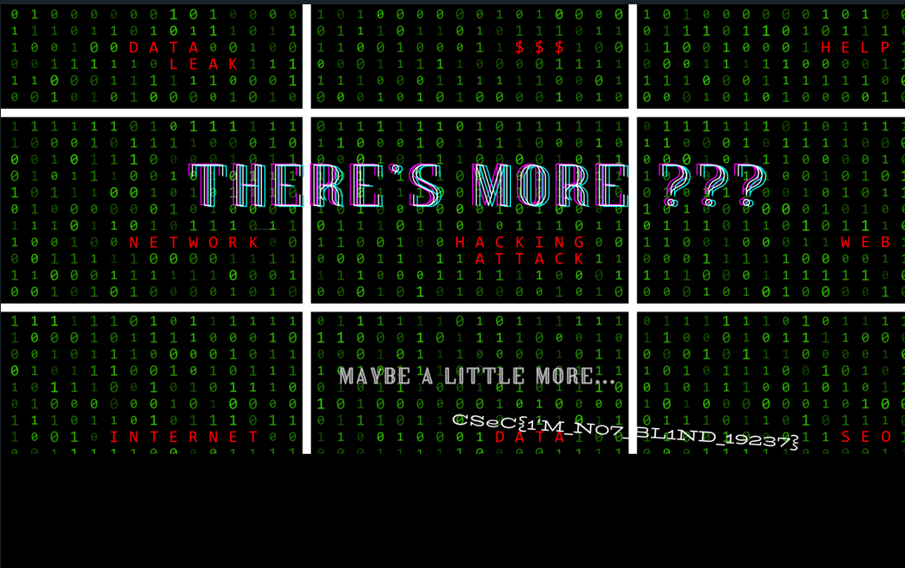

# Steganography Challenge (PNG File)

## Why Use Terminal-Based Editors (e.g., Vim) Over Notepad?
Notepad is convenient for text files but lacks essential features for cybersecurity tasks. Opening non-text files in Notepad can produce unreadable characters since these files often use ASCII encoding. ASCII maps characters to numbers from 0 to 255, many of which aren't human-readable. To interpret and manipulate these files efficiently, hexadecimal (base-16) representation is preferred, as it provides a way to visualize and edit binary data.

## PNG File Structure
Every PNG file starts with a unique file signature: `89 50 4E 47 0D 0A 1A 0A`. The file consists of several chunks, each structured with:
- **Size**: The number of bytes in the chunk's data.
- **Type**: A 4-character identifier (e.g., IHDR, IDAT, IEND).
- **Data**: The content of the chunk.
- **CRC**: A checksum to ensure the chunk's integrity.

In this challenge, the image suggests that there's hidden data, possibly indicated by a premature file termination. The **IHDR** chunk stores the width and **height** of the image, which might be manipulated to reveal hidden content.


## Steps to Solve
1. **Open the File**:  
   Use a Linux terminal or WSL and open the PNG file in Vim:  
   ```bash
   vim moredor.png
   ```
2. **View Hexdump**:  
   To see the file content in hexadecimal format, use the command: 
   ```bash
   :%!xxd
   ```
3. **Locate IHDR**:
    Scroll through the hexdump to find the IHDR chunk. The 4 bytes following IHDR are for width, check the next 4 bytes for height.
4. **Modify the Height**:
    Edit the height by increasing its hexadecimal value until the hidden flag becomes visible.
5. **Exit Hexdump Mode**:
    After editing, convert the file back from hexdump view:
    ```bash
    :%!xxd -r
    ```

Pro Tip: Use `/"any string"` to find all instance of that in vim. Can be used to find IHDR quickly.
